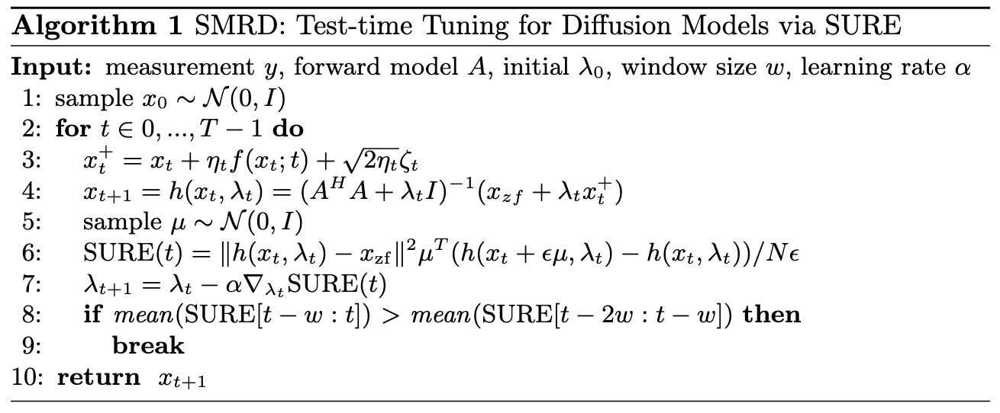
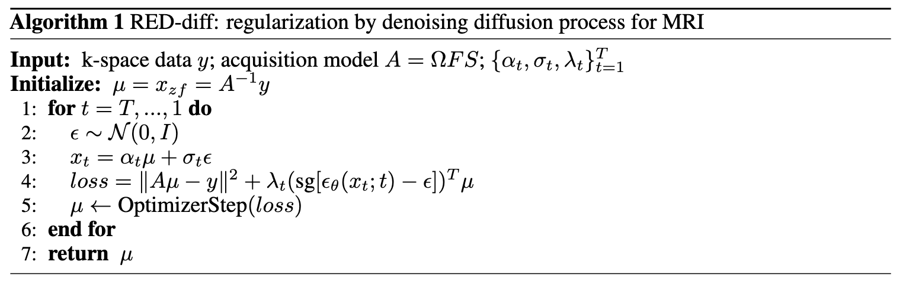
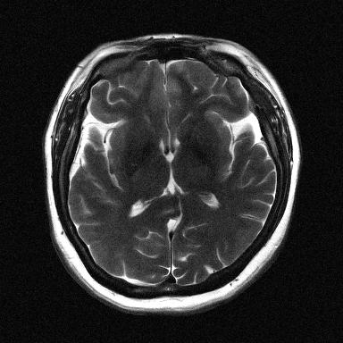

# SMRD

This repository implements two papers for diffusion model based MRI reconstruction:

1. SURE-Based Robust MRI Reconstruction with Diffusion Models (SMRD). MICCAI 2023 (https://link.springer.com/chapter/10.1007/978-3-031-43898-1_20)



2. Regularization by Denoising Diffusion Process for MRI Reconstruction. MIDL 2023 (https://openreview.net/forum?id=M1V498MXelq)



For business inquiries, please visit our website and submit the form: [NVIDIA Research Licensing](https://www.nvidia.com/en-us/research/inquiries/).

The code for SMRD and RED-diff MRI was developed based on the [CSGM-langevin](https://github.com/utcsilab/csgm-mri-langevin) repository.

### Setup

To run, please follow guidelines from the [CSGM-langevin](https://github.com/utcsilab/csgm-mri-langevin) repository. The steps that must be completed are:


1. Setup environment
2. Install BART for sensitivity map estimation
3. Download data and checkpoints
4. Script for estimating sensitivity maps from data

Alternatively, sensitivity maps can be estimated using SENSE, or J-SENSE as done in SMRD, which are available in [Sigpy](https://sigpy.readthedocs.io/en/latest/).

To ensure a smooth setup, please make sure that all the versions of the packages listed in `requirements.txt` are compatible with each other.

## Example commands
We provide configuration files in ```configs/``` that contain hyper-parameters used in our experiments. Here are example commands for using the configuration files. An example is in the run_inf.sh script file.

1. SMRD, T2-Brains:
```python SMRD.py +demo=SMRD-brain_T2-noise005-R8```
1. RED-diff MRI, T2-Brains:
```python reddiff-MRI.py +demo=REDdiff-brain_T2-noise00-R4```
1. To change configurations from command line:
```python SMRD.py +demo=SMRD-brain_T2-noise005-R8 early_stop=stop lambda_func=learnable exp_name=demo-v2 noise_std=0.005```

Configuration files for other anatomies can be found in the [CSGM-langevin](https://github.com/utcsilab/csgm-mri-langevin) repository.

## Outputs

1. SMRD



2. RED-diff MRI


Running the configuration files specified in the example commands section, the results should resemble the examples above. Sensitivity map estimation and mask generation stages might result in slight variations.

## Acknowledgements

The code for SMRD and RED-diff MRI was developed based on the [CSGM-langevin](https://github.com/utcsilab/csgm-mri-langevin) repository.

RED-diff MRI code was developed based on [RED-diff](https://github.com/NVlabs/RED-diff). [Project MONAI](https://github.com/Project-MONAI/), an initiative started by NVIDIA for AI in healthcare imaging is utilized.

## About

If you use this repository for your work, please consider citing the following work:

```
@inproceedings{ozturkler2023smrd,
  title         = {{SMRD}: SURE-based Robust {MRI} Reconstruction with Diffusion Models},
  author        = {Batu Ozturkler and Chao Liu and Benjamin Eckart and Morteza Mardani and Jiaming Song and Jan Kautz},
  booktitle     = {International Conference on Medical Image Computing and Computer Assisted Intervention (MICCAI)},
  pages         = {199--209},
  year          = {2023},
  organization  = {Springer}
}
```

```
@inproceedings{
ozturkler2023regularization,
title={Regularization by Denoising Diffusion Process for {MRI} Reconstruction},
author={Batu Ozturkler and Morteza Mardani and Arash Vahdat and Jan Kautz and John M. Pauly},
booktitle={Medical Imaging with Deep Learning, short paper track},
year={2023},
url={https://openreview.net/forum?id=M1V498MXelq}
}
```

## Contact

For questions or comments, contact [ozt@stanford.edu](ozt@stanford.edu).
